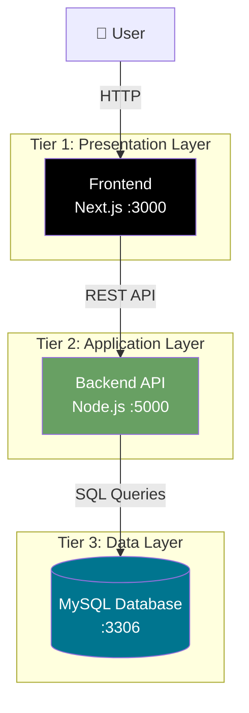

# 🚀 Full-Stack DevOps Three-Tier Application

A **production-ready three-tier architecture** application built using **Next.js**, **Node.js**, **MySQL**, **Docker**, **GitHub Actions**, and **AWS EC2** with a complete **CI/CD pipeline**.

---

## 📖 Table of Contents
- [Architecture](#-architecture)
- [Deployment Pipeline](#-deployment-pipeline)
- [Project Structure](#-project-structure)
- [Prerequisites](#-prerequisites)
- [Getting Started](#-getting-started)
- [Docker Configuration](#-docker-configuration)
- [GitHub Actions CI/CD](#-github-actions-cicd)
- [Production Deployment](#-production-deployment)
- [API Documentation](#-api-documentation)
- [Troubleshooting](#-troubleshooting)
- [License](#-license)

---

## 🏗 Architecture

### 🔹 Three-Tier Architecture Overview

graph LR
    A[👨‍💻 Developer] -->|git push| B[GitHub]
    B -->|Triggers| C[GitHub Actions]
    C -->|Build & Test| D[Docker Images]
    D -->|Push to| E[Docker Hub]
    E -->|Pull & Deploy| F[AWS EC2]
    F -->|docker compose| G[🚀 Production]

    style E fill:#2496ED,color:#fff
    style F fill:#FF9900,color:#000

devops-tier3-app/
├── .github/
│   └── workflows/
│       └── ci-cd.yml
├── frontend/
│   ├── public/
│   ├── src/
│   │   ├── app/
│   │   ├── components/
│   │   └── styles/
│   ├── package.json
│   ├── next.config.js
│   ├── .env.local
│   ├── Dockerfile
│   └── .dockerignore
├── backend/
│   ├── src/
│   │   ├── controllers/
│   │   ├── routes/
│   │   ├── models/
│   │   └── config/
│   ├── package.json
│   ├── server.js
│   ├── .env
│   ├── Dockerfile
│   └── .dockerignore
├── database/
│   ├── init.sql
│   └── Dockerfile
├── docker-compose.yml
├── docker-compose.prod.yml
├── .env.example
├── .gitignore
└── README.md

git clone https://github.com/your-username/devops-tier3-app.git
cd devops-tier3-app

docker compose up -d
docker compose down
docker ps
